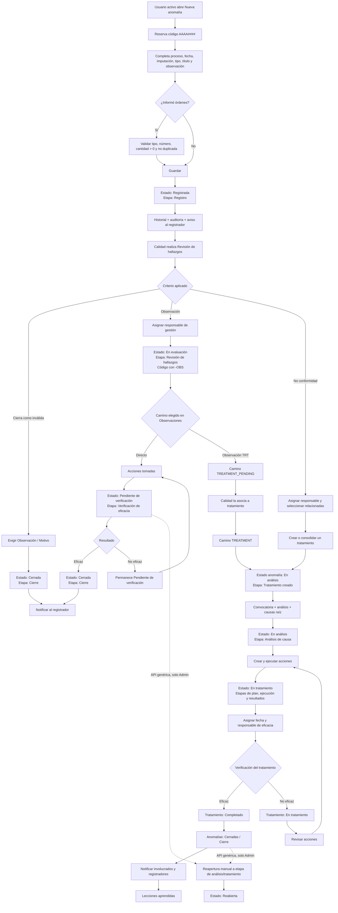
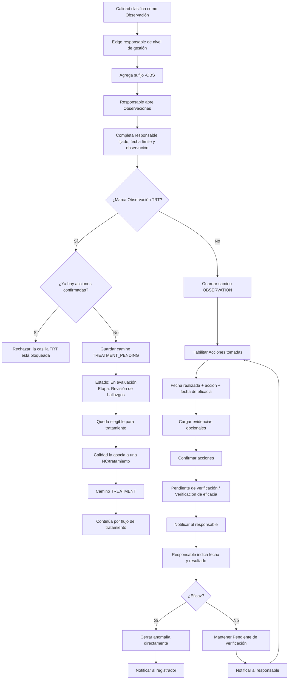
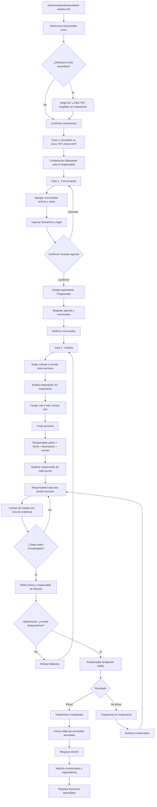
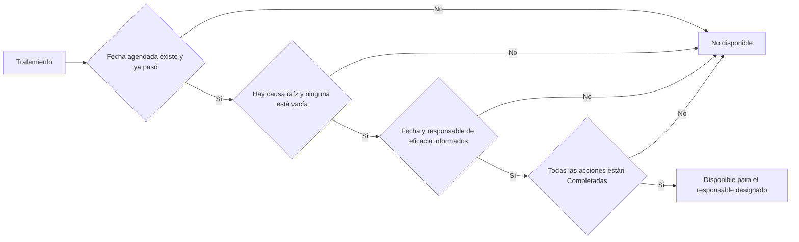
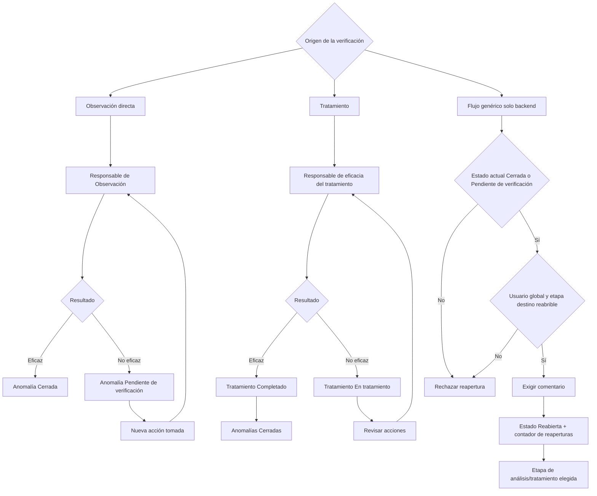
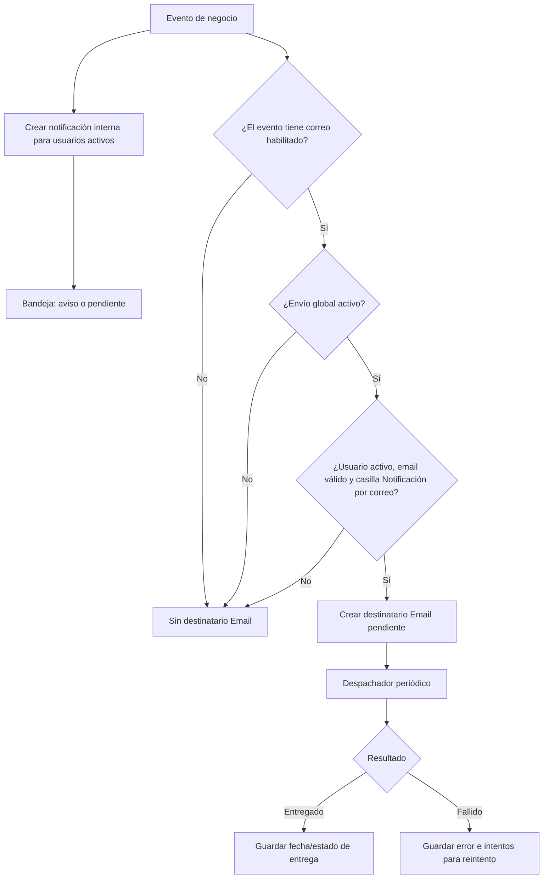

# Flujos del Sistema de Gestión de Calidad

## Convenciones

- Los diagramas representan el comportamiento comprobado en código.
- Un nodo con “solo backend” no tiene control de usuario comprobado en la interfaz React.
- Los nombres de estado se muestran con su etiqueta funcional real.
- La clasificación concreta depende del maestro **Criterios de Revisión de hallazgos**. Los diagramas muestran los caminos que el código reconoce específicamente.

## 1. Flujo completo de una anomalía

### Nota sobre la secuencia funcional esperada

La secuencia de referencia `Registrada → Clasificada → Asignada → En tratamiento → Cerrada por responsable → Verificación → Cerrada definitiva` no existe como una sucesión de estados separados. “Clasificada”, “Asignada” y “Cerrada por responsable” son eventos o responsabilidades, no estados del modelo.

## 2. Flujo de una Observación

### Brechas representadas

- No hay cierre intermedio del responsable seguido de cierre definitivo de Calidad.
- “No eficaz” no asigna el estado Reabierta.
- El verificador de la Observación es el mismo responsable de la gestión.

## 3. Flujo de una No conformidad y su tratamiento

### Bloqueadores reales de Validaciones

No son bloqueadores explícitos: convocatoria confirmada, lugar, método, observaciones, evidencia, existencia de al menos una acción y duración de reunión.

## 4. Verificación de eficacia y reapertura

### Interpretación

El estado Reabierta existe y el indicador de Eficacia contabiliza `reopened_count`, pero los dos flujos visibles de no eficacia no lo utilizan. La reapertura es una transición administrativa genérica sin botón comprobado.

## 5. Responsabilidades y permisos por nivel

```mermaid
flowchart TD
    A[Usuario autenticado y activo] --> B{Nivel de acceso}

    B --> U[Usuario activo]
    U --> U1[Registrar anomalía]
    U --> U2[Consultar anomalías relacionadas]
    U --> U3[Ejecutar acción si es responsable]
    U --> U4[Verificar eficacia si es responsable designado]
    U --> U5[Consultar tratamiento si está relacionado]

    B --> M[Mando medio activo]
    M --> M1[Todo lo asignable a Usuario activo]
    M --> M2[Gestionar Observación si es responsable]
    M --> M3[Gestionar Tratamiento si es responsable]
    M --> M4[Convocar, analizar, cargar causas y crear acciones]
    M --> M5[Delegar acciones a usuarios activos]

    B --> AD[Administrador]
    AD --> AD1[Acceso global a datos]
    AD --> AD2[Revisión de hallazgos]
    AD --> AD3[Conformar/corregir tratamientos]
    AD --> AD4[Panel, indicadores y órdenes afectadas]
    AD --> AD5[Usuarios, alcances y catálogos]
    AD --> AD6[No puede validar eficacia ajena]

    B --> DEV[Desarrollador]
    DEV --> DEV1[Capacidades de Administrador]
    DEV --> DEV2[Superusuario y panel técnico]
    DEV --> DEV3[Puede asignar nivel Desarrollador]

    A --> R{¿Existe asignación exacta?}
    R -- Responsable de acción --> RA[Cambiar estado y cargar evidencia]
    R -- Responsable de eficacia --> RV[Confirmar eficacia]
    R -- Solo convocado --> RC[Consultar y confirmar participación; no editar análisis]
    R -- Sin relación y no global --> RX[No ver el caso]
```

## 6. Notificaciones y correo

La Bandeja no depende de la casilla de correo. La casilla solo controla el canal Email.
