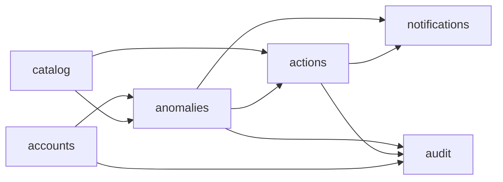

# Dominios Backend y Limites de Responsabilidad

## Apps base propuestas

| App | Rol principal | Entidades iniciales | Observaciones |
|---|---|---|---|
| `core` | componentes transversales | `BaseModel`, mixins, enums tecnicos | No debe absorber logica de dominio |
| `accounts` | identidad, autenticacion y alcance | `User`, `Role`, `UserRoleScope` | Usar custom user desde el inicio |
| `catalog` | maestros corporativos | `Site`, `Area`, `Line`, `AnomalyType`, `Severity`, `Priority`, `ActionType` | Reutilizable por modulos futuros |
| `anomalies` | aggregate root del modulo inicial | `Anomaly`, `AnomalyStatusHistory`, `AnomalyComment`, `AnomalyAttachment` | Controla el workflow |
| `actions` | planes y acciones correctivas | `ActionPlan`, `ActionItem`, `ActionEvidence` | Separada para reuso futuro |
| `notifications` | avisos y recepcion | `Notification`, `NotificationRecipient`, `NotificationTemplate` | No decide reglas de negocio |
| `audit` | trazabilidad inmutable | `AuditEvent` | Debe registrar eventos cross-domain |

## Estructura sugerida por app

```text
apps/<app_name>/
|- api/
|  |- serializers/
|  |- views/
|  \- urls.py
|- models/
|- services/
|- selectors/
|- migrations/
|- tests/
|- apps.py
\- permissions.py
```

## Reglas de modularidad

- `api/` expone casos de uso y contratos HTTP.
- `services/` implementa logica de aplicacion y workflow.
- `selectors/` concentra consultas complejas y lectura optimizada.
- `models/` define entidades y restricciones persistentes.
- `tests/` debe reflejar casos por dominio, no solo endpoints.

## Interaccion entre apps



## Acoplamientos permitidos

- `anomalies` puede depender de `accounts`, `catalog`, `actions`, `audit` y `notifications`.
- `actions` puede depender de `accounts`, `catalog`, `audit` y `notifications`.
- `catalog` no depende de modulos transaccionales.
- `audit` no debe imponer dependencia circular de dominio; registra eventos recibidos.
- `notifications` consume eventos de negocio, pero no determina transiciones.

## Criterios clave por dominio

### `accounts`

- Custom user obligatorio
- Roles de negocio desacoplados de permisos tecnicos
- Alcance por sitio y area para no sobredimensionar permisos globales

### `catalog`

- Catalogos con `code`, `name`, `is_active`, `display_order`
- Nunca borrar maestros con historico
- Debe permitir multisitio y futuras clasificaciones

### `anomalies`

- Es el aggregate root del primer modulo
- Tiene el estado actual, pero el historial es append-only
- Debe impedir cierres y transiciones invalidas
- Debe conservar comentarios, adjuntos y reasignaciones

### `actions`

- No debe quedar embebida dentro de `anomalies`
- Una accion debe poder ser reutilizable por futuros modulos
- Debe soportar plan, items, vencimientos, responsable y evidencia

### `notifications`

- Maneja cola logica de destinatarios y estados de entrega/lectura
- Los templates deben ser parametrizables
- La politica de a quien notificar se decide desde el dominio emisor

### `audit`

- Debe ser append-only
- Registra actor, accion, timestamp, entidad, contexto y before/after
- Debe poder correlacionar eventos por `request_id` o `correlation_id`

## Regla transversal critica

Las operaciones de negocio deben entrar por un servicio de dominio, no por escritura directa del modelo desde la capa API. Esta regla es especialmente importante para:

- cambio de estado de anomalias
- reasignaciones
- cierres
- reaperturas
- creacion y cierre de acciones
- adjuntos con impacto de auditoria
