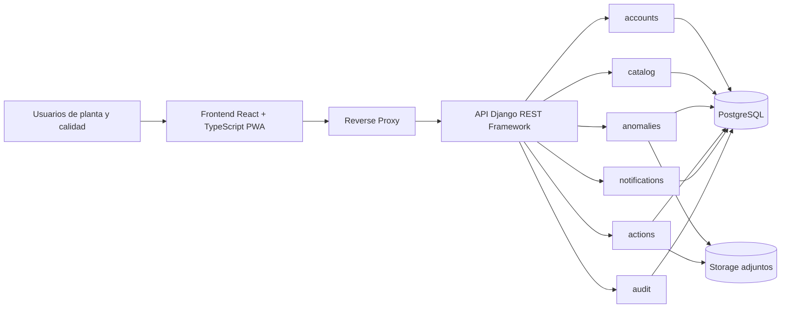
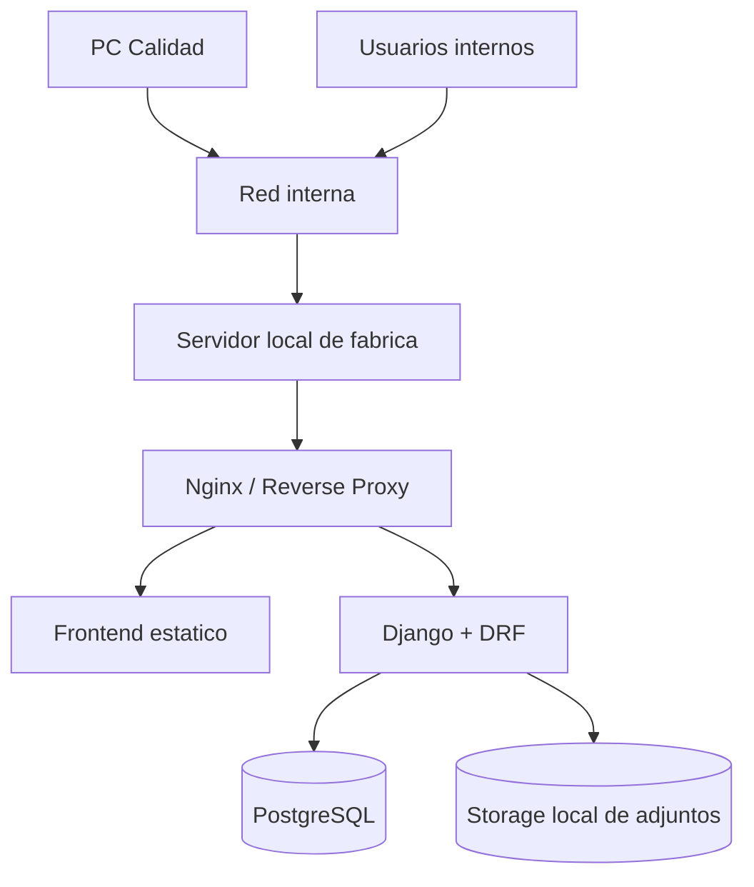

# Vista General del Sistema

## Principios de arquitectura

- Backend como fuente unica de verdad de negocio
- Monolito modular con limites de dominio explicitos
- Persistencia centralizada y transaccional
- Frontend delgado y desacoplado
- Despliegue local inicial con diseño cloud-ready
- Trazabilidad obligatoria en operaciones relevantes

## Vista logica

## Responsabilidades por capa

### Frontend

- autenticacion y gestion de sesion desde la UX
- formularios, filtros y navegacion
- renderizado responsive
- instalacion como PWA
- cache no autoritativo del shell y catalogos de baja volatilidad

No le corresponde:

- decidir transiciones validas
- cerrar anomalias
- validar reglas de negocio criticas
- consolidar trazabilidad

### API / Aplicacion

- exponer endpoints versionados
- autenticar y autorizar
- orquestar servicios de dominio
- abrir transacciones por caso de uso
- publicar auditoria y notificaciones

### Dominio

- reglas del workflow
- validaciones de consistencia
- restricciones de cierre
- ownership y asignaciones
- generacion de codigos
- coordinacion con acciones correctivas

### Persistencia

- constraints
- indices
- integridad referencial
- historico
- consulta eficiente

## Topologia de despliegue inicial

## Topologia objetivo futura en nube

La misma separacion permite evolucionar a:

- frontend servido por CDN o web app
- backend en contenedor o app service
- PostgreSQL administrado
- storage de objetos para adjuntos
- proxy/gateway central

El cambio principal seria de infraestructura, no de arquitectura funcional.

## Ciclo basico de una operacion

1. El usuario opera desde la PWA.
2. La PWA invoca un endpoint de caso de uso.
3. DRF valida formato y autenticacion.
4. Un servicio de dominio ejecuta la regla de negocio dentro de transaccion.
5. Se actualiza la entidad principal y su historial.
6. Se registra auditoria.
7. Se generan notificaciones si corresponde.
8. La API responde con el estado consolidado.

## Decisiones operativas importantes

- La PC de Calidad no aloja servicios ni base de datos.
- El backend debe ser stateless respecto de negocio.
- Los adjuntos nunca se guardan en el frontend.
- El sistema debe tolerar crecimiento a multiples sitios, areas y usuarios concurrentes.
