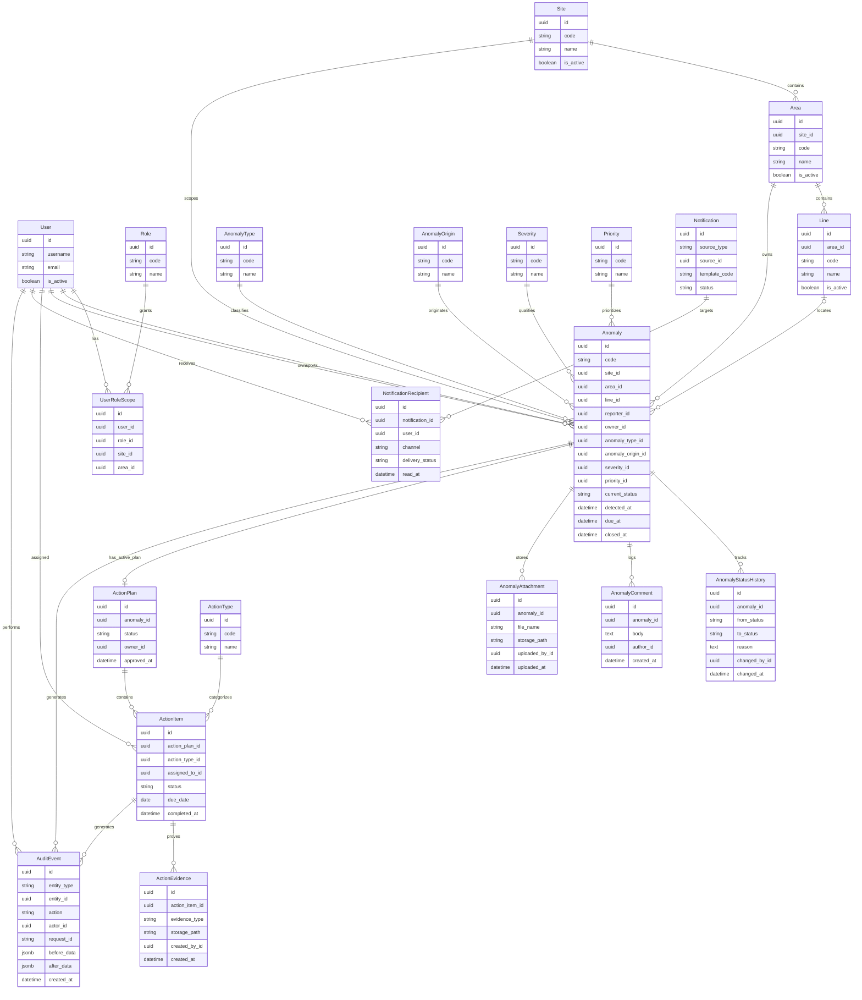

# ERD Inicial y Modelo de Datos Base

## Objetivo

Definir un modelo de datos inicial consistente con:

- sistema multiusuario
- operacion multi-sitio y multi-area
- workflow de anomalias
- acciones correctivas
- trazabilidad y auditoria

## Convenciones generales

- Todas las entidades transaccionales incluyen `created_at`, `created_by`, `updated_at`, `updated_by`.
- No se realiza hard delete sobre entidades de negocio.
- Los catalogos se inactivan mediante `is_active`.
- El usuario debe ser `CustomUser` desde el inicio.
- Las entidades criticas deben considerar control de concurrencia optimista con `row_version`.

## ERD conceptual inicial

## Restricciones recomendadas

### Unicidad

- `Site.code` unico
- `Area.code` unico por `site`
- `Line.code` unico por `area`
- `Role.code` unico
- `Anomaly.code` unico global
- `UserRoleScope` unico por `user + role + site + area`
- `NotificationRecipient` unico por `notification + user + channel`

### Integridad de negocio

- `Anomaly.closed_at` solo puede tener valor cuando `current_status = closed`
- `ActionItem.completed_at` solo puede tener valor cuando `status = completed`
- `ActionPlan` debe tener a lo sumo un plan activo por anomalia
- `AnomalyStatusHistory` es append-only
- `AuditEvent` es append-only

### Indices clave

- `Anomaly(current_status, priority_id, area_id)`
- `Anomaly(code)`
- `Anomaly(detected_at)`
- `ActionItem(status, due_date, assigned_to_id)`
- `AuditEvent(entity_type, entity_id, created_at)`
- `NotificationRecipient(user_id, delivery_status, read_at)`

## Observaciones de diseño

- `Anomaly` es el aggregate root y concentra el identificador funcional del caso.
- `ActionPlan` y `ActionItem` se modelan separados para evitar acoplar el workflow de ejecucion con la entidad principal.
- `AuditEvent` no reemplaza historiales de negocio especializados; los complementa.
- Los adjuntos solo guardan metadata en base; el binario vive en storage.
