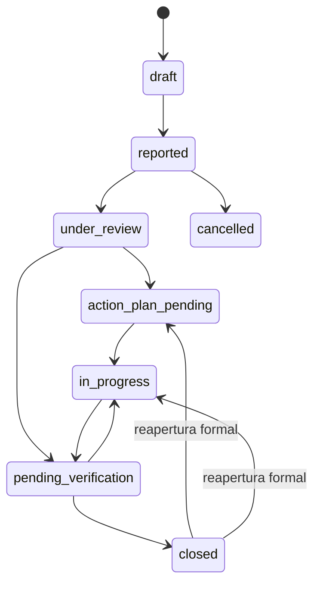

# Workflow del Modulo de Anomalias

## Objetivo

Definir el flujo base del primer modulo con reglas aptas para una operacion corporativa multiusuario, con trazabilidad completa y posibilidad de crecimiento posterior.

## Estados propuestos

| Estado | Codigo interno | Objetivo |
|---|---|---|
| Borrador | `draft` | Registro inicial aun no presentado |
| Reportada | `reported` | Alta formal realizada |
| En revision | `under_review` | Clasificacion y analisis inicial |
| Plan pendiente | `action_plan_pending` | Requiere plan o definicion de acciones |
| En ejecucion | `in_progress` | Acciones en curso |
| Pendiente de verificacion | `pending_verification` | Acciones ejecutadas, esperando validacion |
| Cerrada | `closed` | Caso verificado y formalmente finalizado |
| Cancelada | `cancelled` | Caso anulado por invalidez, duplicado o error de alta |

## Diagrama de estados

## Reglas de transicion de alto nivel

| Desde | Hacia | Regla base |
|---|---|---|
| `draft` | `reported` | Debe existir informacion minima obligatoria y usuario autenticado |
| `reported` | `under_review` | Debe asignarse responsable inicial o area responsable |
| `reported` | `cancelled` | Motivo obligatorio y permiso especial |
| `under_review` | `action_plan_pending` | Se confirma necesidad de acciones formales |
| `under_review` | `pending_verification` | Solo si no requiere plan formal pero si validacion |
| `action_plan_pending` | `in_progress` | Debe existir plan activo y al menos una accion valida |
| `in_progress` | `pending_verification` | Todas las acciones obligatorias deben estar completadas |
| `pending_verification` | `closed` | Validacion efectiva, comentario de cierre y auditoria obligatoria |
| `pending_verification` | `in_progress` | La verificacion falla o requiere retrabajo |
| `closed` | `action_plan_pending` o `in_progress` | Solo por reapertura autorizada con motivo |

## Restricciones de cierre

Una anomalia no puede cerrarse si falta cualquiera de los siguientes puntos:

- clasificacion completa
- responsable funcional asignado
- severidad y prioridad definidas
- comentario final de resolucion
- evidencia de verificacion
- todas las acciones obligatorias en estado final
- registro de auditoria de cierre en la misma transaccion

Para anomalias severas o criticas, se recomienda ademas:

- verificador distinto del ejecutor principal
- comentario de aprobacion del verificador
- evidencia adjunta obligatoria

## Trazabilidad obligatoria

Deben registrarse como minimo los siguientes eventos:

- creacion de anomalia
- cambio de campos criticos
- cambio de estado
- reasignacion de owner o responsable
- cambio de prioridad o severidad
- alta, edicion y cierre de acciones
- adjuntos y evidencias
- cancelacion
- reapertura
- cierre
- notificaciones emitidas

## Regla tecnica critica

El estado actual de `Anomaly` no debe actualizarse mediante escrituras directas desde la API ni desde formularios administrativos. Toda transicion debe pasar por un servicio de workflow que:

1. valide permiso y alcance del usuario
2. verifique el estado actual
3. evalue precondiciones
4. persista el nuevo estado
5. inserte `AnomalyStatusHistory`
6. genere `AuditEvent`
7. dispare notificaciones si aplica

## Restricciones complementarias

- No se permite borrar comentarios ni historiales.
- Los adjuntos no se reemplazan; se agregan como evidencia nueva.
- La cancelacion requiere motivo.
- La reapertura requiere motivo y usuario autorizado.
- La concurrencia debe controlarse para evitar doble cierre o doble transicion.

## Actores funcionales de referencia

- Reportante: registra la anomalia
- Responsable/Owner: coordina el caso
- Ejecutor: realiza acciones correctivas
- Verificador: valida efectividad
- Administrador funcional: puede reasignar o cancelar con permisos adecuados
